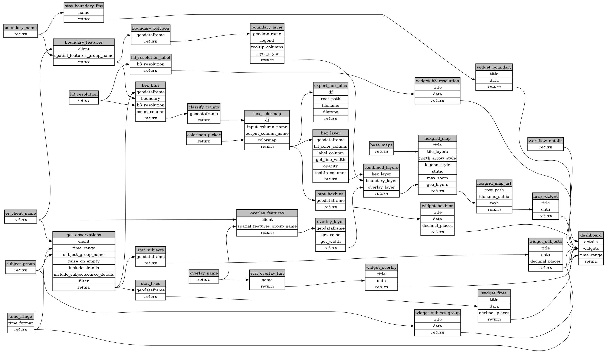

```
# AUTOGENERATED BY ECOSCOPE-WORKFLOWS; see fingerprint in README.md for details

```

```yaml
# fingerprint:
artifacts_sha256_basic: dc25369b069358195e55361fa8e5ae4214d459a2c756386b8c7ca2d7965b6255
artifacts_sha256_strict: 58212356229c6dbc396ce0b02cf80e3aaa9c17f947d88a83e6e75e72b9fd1692
installed_requirements:
- channel: https://repo.prefix.dev/ecoscope-workflows/
  name: ecoscope-platform
  version: {version: ==2.11.15}
params_sha256: 813c2859dd6805d91fdb1f15f59c5b231f526fff399e40b78a62e087f7ce2aca
spec_sha256: 67293d7fd02430b99d2b6b5ba52bf597eae543b1a735a5f86c102c02d742f968

```

# ecoscope-workflows-subject-hexgrid-workflow


